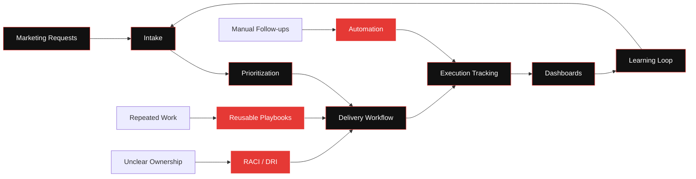

<!-- GitHub Profile README for github.com/he8um -->

  

  

  
  
  

  
  
  

  

## What I Actually Do

<table>
  <tr>
    <td width="58%" valign="top">
      

        I work at the intersection of <strong>Technical Project Management</strong>,
        <strong>Marketing Operations</strong>, and <strong>System Design</strong>.
      

      

        I do not only manage projects. I design the operating systems behind them:
        the workflows, ownership models, automations, dashboards, documentation,
        and feedback loops that make execution reliable.
      

      <table>
        <tr><td><code>chaos</code></td><td>→</td><td><strong>structure</strong></td></tr>
        <tr><td><code>requests</code></td><td>→</td><td><strong>workflows</strong></td></tr>
        <tr><td><code>manual work</code></td><td>→</td><td><strong>automation</strong></td></tr>
        <tr><td><code>meetings</code></td><td>→</td><td><strong>visibility</strong></td></tr>
        <tr><td><code>follow-ups</code></td><td>→</td><td><strong>feedback loops</strong></td></tr>
        <tr><td><code>documentation</code></td><td>→</td><td><strong>execution memory</strong></td></tr>
      </table>
    </td>
    <td width="42%" valign="top">
      <h3> Core Focus</h3>
      <ul>
        <li>Marketing operations systems</li>
        <li>Project delivery infrastructure</li>
        <li>ClickUp and Airtable architecture</li>
        <li>Automation and integrations</li>
        <li>Internal tools and dashboards</li>
        <li>Documentation architecture</li>
        <li>AI-agent and MCP workflows</li>
      </ul>
      

        
      

    </td>
  </tr>
</table>

---

## The Operating System I Build

---

## Systems I Like Building

<table>
  <tr>
    <td width="33%" valign="top">
      <h3> Workflow Systems</h3>
      <ul>
        <li>Request intake</li>
        <li>Task lifecycle design</li>
        <li>Status architecture</li>
        <li>Ownership models</li>
        <li>Delivery pipelines</li>
        <li>Operational playbooks</li>
      </ul>
    </td>
    <td width="33%" valign="top">
      <h3>Automation Systems</h3>
      <ul>
        <li>Cross-tool synchronization</li>
        <li>Workflow automations</li>
        <li>API integrations</li>
        <li>Notification routing</li>
        <li>Scheduled data pipelines</li>
        <li>Manual-work reduction</li>
      </ul>
    </td>
    <td width="34%" valign="top">
      <h3> Visibility Systems</h3>
      <ul>
        <li>Delivery dashboards</li>
        <li>Progress and risk tracking</li>
        <li>Bottleneck detection</li>
        <li>Decision logs</li>
        <li>Documentation hubs</li>
        <li>Operational reporting</li>
      </ul>
    </td>
  </tr>
</table>

  

---

## Tools, Platforms & Engineering Stack

  

  
  
  
  

  
  
  
  
  

---

## Current Direction

<table>
  <tr>
    <td width="50%" valign="top">
      <h3>Building</h3>
      <ul>
        <li>AI-ready project management toolkits</li>
        <li>Marketing operations automation</li>
        <li>Internal productivity platforms</li>
        <li>Go and Rust utility tools</li>
        <li>Public data dashboards</li>
      </ul>
    </td>
    <td width="50%" valign="top">
      <h3>Improving</h3>
      <ul>
        <li>Request intake and prioritization</li>
        <li>Agent-compatible documentation</li>
        <li>Delivery visibility and governance</li>
        <li>Reusable workflows and playbooks</li>
        <li>Operational intelligence</li>
      </ul>
    </td>
  </tr>
</table>

  

## GitHub Activity

  
  

  

  

---

## Philosophy

  I care about the operational layer behind creative and technical work: 
  where requests become projects, projects become workflows, 
  workflows become systems, and systems make teams faster.

  

  
  
  

  

