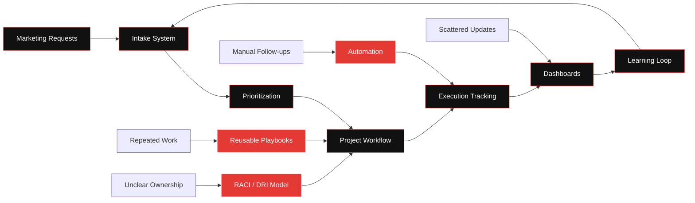
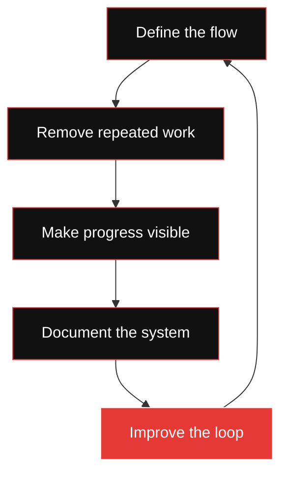
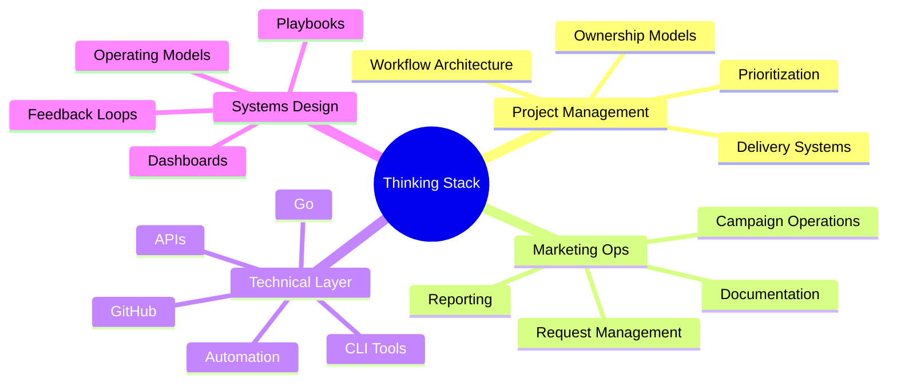

<!-- GitHub Profile README - he8um -->

  

  

  
  
  
  
  
  

---

<table>
<tr>
<td width="56%" valign="top">

<h2>🧠 What I Actually Do</h2>

I work at the intersection of <b>Technical Project Management</b>, <b>Marketing Operations</b>, and <b>System Design</b>.

I do not just manage projects.
 
I build the operating systems behind them.

Systems that make teams move faster, reduce manual work, clarify ownership, improve visibility, and turn scattered marketing execution into structured delivery.

<pre>
chaos          → structure
requests       → workflows
manual work    → automation
meetings       → visibility
projects       → systems
follow-ups     → feedback loops
documentation  → execution memory
</pre>

</td>
<td width="44%" valign="top">

<h2>⚙️ Core Focus</h2>

<pre>
Marketing Ops Systems
Project Management Infrastructure
ClickUp & Airtable Workflows
Automation & Integrations
Delivery Dashboards
Documentation Architecture
Internal Tools
Operational Visibility
Technical Product Thinking
</pre>

  

</td>
</tr>
</table>

---

  

<h2 align="center">🧩 The Layer I Care About</h2>

---

<h2 align="center">🛠️ Systems I Like Building</h2>

<table>
<tr>
<td width="33%" valign="top">

<h3>🧭 Workflow Systems</h3>

<ul>
  <li>Task lifecycle design</li>
  <li>Request intake flows</li>
  <li>Ownership models</li>
  <li>Status architecture</li>
  <li>Delivery pipelines</li>
  <li>Operational playbooks</li>
</ul>

</td>
<td width="33%" valign="top">

<h3>⚡ Automation Systems</h3>

<ul>
  <li>ClickUp automations</li>
  <li>Airtable databases</li>
  <li>Tool-to-tool syncs</li>
  <li>Reporting loops</li>
  <li>Notification flows</li>
  <li>Manual work reduction</li>
</ul>

</td>
<td width="33%" valign="top">

<h3>📊 Visibility Systems</h3>

<ul>
  <li>Delivery dashboards</li>
  <li>Progress tracking</li>
  <li>Team reporting</li>
  <li>Bottleneck detection</li>
  <li>Documentation hubs</li>
  <li>Decision logs</li>
</ul>

</td>
</tr>
</table>

---

  

---

<h2 align="center">🧱 My Operating Model</h2>

  
  
  
  
  

---

<h2 align="center">🧰 Tools, Platforms & Thinking Stack</h2>

  

  
  
  
  
  

  
  
  
  

  
  
  
  
  

---

<h2 align="center">📈 GitHub Activity</h2>

  
  

  

  

---

<h2 align="center">🧪 Currently Exploring</h2>

<table>
<tr>
<td width="50%" valign="top">

<pre>
Marketing Ops automation
ClickUp × Airtable systems
Internal productivity tooling
Go-based utility tools
Project visibility dashboards
AI-assisted operations
</pre>

</td>
<td width="50%" valign="top">

<pre>
Better intake systems
Reusable playbooks
Technical documentation
Workflow intelligence
Delivery quality systems
Operational design
</pre>

</td>
</tr>
</table>

---

<h2 align="center">🧭 Direction</h2>

<pre>
I care about the operational layer behind creative and marketing work.

The layer where requests become projects,
projects become workflows,
workflows become systems,
and systems make teams faster.
</pre>

  

---

  
  
  

  

