  

# XHESAM / OPERATIONS CONTROL PLANE

I work at the intersection of **Product, Projects, Operations, Data, Automation and Systems**.

The public surface below is built as a small control plane: structured source data, generated SVG interfaces, and first-party GitHub telemetry. It is not a generic developer stats board; the intent is to show how operating models and technical systems connect.

  <a href="https://xhesam.com">Website</a> /
  <a href="https://www.linkedin.com/in/he8um/">LinkedIn</a> /
  <a href="mailto:info@xhesam.com">Email</a>

## 01 / Operator

I design the operating systems behind execution: how work enters a team, becomes structured, gains ownership, moves through delivery, becomes observable, and produces evidence for the next decision.

My work sits between product management, project governance, marketing operations, workflow automation, operational data, and AI-assisted delivery. I care about the model underneath the interface: status semantics, ownership, handoffs, validation, automation boundaries, and the architecture that keeps a process from turning into a spreadsheet-shaped dependency.

## 02 / Current Operations

  

Private/internal systems are represented at a safe abstraction level. Public repositories and pages are linked where that evidence can be shown without exposing confidential context.

## 03 / System Map

  

The map is the point: the work is not isolated artifacts. Product decisions shape the operating model; the operating model defines the data; the data enables automation; automation and AI support delivery only when ownership and validation are explicit.

## 04 / Mission Archive

| ID | System | Objective | Role | State |
|---|---|---|---|---|
| OP-014 | Boxja Platform | Scalable booking platform for rentable creative spaces. | Product / System Design / Delivery | Active |
| OP-009 | [AirBridge](https://github.com/he8um/AirBridge) | Local-first backup, inspection and restore-planning layer for Airtable bases. | Product / Architecture / Implementation | Public alpha |
| OP-007 | [OH MY PM](https://github.com/he8um/oh-my-pm) | Repository-aware project intelligence, governed memory and delivery context tooling. | Product / System Design / Engineering | Active development |
| OP-006 | [Maestro Skills](https://github.com/he8um/product-maestro) | Product, marketing, architecture and technical decision systems as reusable agent skills. | Information Architecture / Governance / Validation | Maintained |

## 05 / Capability Matrix

| Capability | Scope | Evidence |
|---|---|---|
| Product | Discovery to delivery | Problem framing, roadmaps, release decisions, product documentation |
| Project | Planning, execution, governance | Ownership models, operating cadence, delivery controls, status systems |
| Operations | Process to system | Marketing operations, finance flows, vendor systems, repeatable workflows |
| Automation | APIs, workflows, agents | n8n, Airtable, ClickUp, MCP, GitHub Actions, integration design |
| Data | Modeling and operational intelligence | Schema design, status taxonomies, validation, BI-facing source structure |
| Architecture | System, API, database | Technical specs, trade-off records, validation gates, implementation handoff |
| AI | Agentic workflows and AI-assisted delivery | Reusable skills, governed prompts, quality gates, safety boundaries |

## 06 / Telemetry

  

Telemetry is generated from selected public repositories through the GitHub API. It intentionally avoids third-party stats widgets and does not invent private project metrics.

## 07 / Operating Doctrine

1. Evidence before assumptions.
2. Clear ownership before automation.
3. Data models before dashboards.
4. Documentation is part of the system.
5. Release discipline beats invisible progress.

## 08 / Comms

[xhesam.com](https://xhesam.com) / [LinkedIn](https://www.linkedin.com/in/he8um/) / [info@xhesam.com](mailto:info@xhesam.com)

Building systems that make execution clearer, safer and more repeatable.
