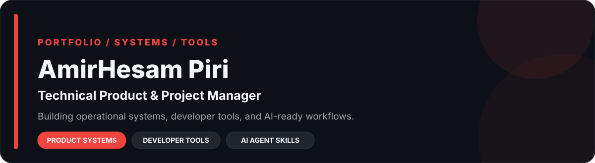

  

  <a href="https://xhesam.com">Website</a> ·
  <a href="https://www.linkedin.com/in/he8um/">LinkedIn</a> ·
  <a href="mailto:info@xhesam.com">Email</a> ·
  <a href="#selected-work">Live Portfolio ↓</a>

## Professional Summary

I design the operating systems behind execution: how work enters a team, gains an owner, moves through a workflow, becomes visible, and produces evidence for the next decision. My public work turns recurring operational problems into local-first products, developer tools, and reusable AI-agent Skills. That includes project intelligence, safe backup tooling, terminal utilities, and governed Skills for product, marketing, architecture, APIs, databases, GitHub, MCP, ClickUp, Airtable, and n8n. Documentation, validation, release discipline, and explicit safety boundaries are treated as product features—not cleanup work.

## Live Portfolio Dashboard

These are live repository boxes—not committed screenshots or generated data charts. Release, last-commit, primary-language, and CI signals are requested from GitHub and Shields when the profile is rendered, so they follow the repositories as they change. Providers may cache responses briefly.

| [OH MY PM](https://github.com/he8um/oh-my-pm) |
|:---|
| Local project intelligence for structured delivery, repository context, governed Project Memory, CLI workflows, and MCP access. |
| `Operational & Product System` · `TypeScript` · `Rust/WASM` · `MCP` |
|     |

| [Daryaft](https://github.com/he8um/daryaft) |
|:---|
| A Go terminal downloader with CLI and Bubble Tea TUI flows, resumable transfers, retries, checksums, diagnostics, and release packaging. |
| `Developer Tool` · `Go` · `Bubble Tea` · `CLI/TUI` |
|     |

| [AirBridge](https://github.com/he8um/AirBridge) |
|:---|
| A local-first desktop app for backing up, inspecting, validating, and planning safe restoration of Airtable bases. |
| `Operational & Product System` · `Tauri` · `Rust` · `React/TypeScript` |
|     |

| [BranchDojo](https://github.com/he8um/branchdojo) |
|:---|
| A Rust CLI that creates disposable Git repositories for practicing conflict, recovery, history, and release workflows. |
| `Developer Tool` · `Rust` · `Git` · `Deterministic Kata` |
|     |

| [Product Maestro](https://github.com/he8um/product-maestro) |
|:---|
| A production-grade Skill for product diagnosis, evidence, strategy, discovery, delivery, measurement, lifecycle, and governance. |
| `AI Agent Skill` · `Python` · `JSON Schema` · `Decision Systems` |
|    |

| [Marketing Maestro](https://github.com/he8um/marketing-maestro) |
|:---|
| A production-grade Skill for evidence-led marketing diagnosis, strategy, execution, measurement, operations, governance, and compliance. |
| `AI Agent Skill` · `Python` · `JSON Schema` · `Marketing Systems` |
|    |

## Live Project Ecosystem

| Operational & Product Systems |
|:---|
| [OH MY PM](https://github.com/he8um/oh-my-pm)  |
| [AirBridge](https://github.com/he8um/AirBridge)  |

| Developer Tools |
|:---|
| [Daryaft](https://github.com/he8um/daryaft)  |
| [BranchDojo](https://github.com/he8um/branchdojo)  |

| AI Agent Skills |
|:---|
| [Product Maestro](https://github.com/he8um/product-maestro)  |
| [Marketing Maestro](https://github.com/he8um/marketing-maestro)  |
| [Software Architecture Maestro](https://github.com/he8um/software-architecture-maestro)  |
| [API Design Skills](https://github.com/he8um/api-design-skills)  |
| [Database Engineering Skills](https://github.com/he8um/database-engineering-skills)  |
| [GitHub Skills](https://github.com/he8um/github-skills)  |
| [MCP Skills](https://github.com/he8um/mcp-skills)  |
| [Airtable Skills](https://github.com/he8um/airtable-skills)  |
| [ClickUp Skills](https://github.com/he8um/clickup-skills)  |
| [n8n Skills](https://github.com/he8um/n8n-skills)  |

## What the Portfolio Covers

- **Operational systems:** project context, ownership, memory, backup, validation, and safe recovery.
- **Developer tools:** Go and Rust CLIs, terminal UX, release engineering, and deterministic practice environments.
- **Agent capabilities:** product, marketing, architecture, API, database, GitHub, MCP, Airtable, ClickUp, and n8n decision systems.
- **Delivery infrastructure:** GitHub Actions, packaging, checksums, documentation governance, testing, and release controls.

## How I Build

**Diagnose → Model → Build → Validate → Operate → Improve**

1. Evidence before assumptions.
2. Clear ownership before automation.
3. Automation after process clarity.
4. Documentation as part of the system.
5. Release discipline over invisible progress.

> Project Management is a System Design Problem.

## Current Focus

- Evolving OH MY PM through its next public product and Project Memory milestones.
- Expanding the Maestro and companion-Skill ecosystem as independently maintained capabilities.
- Improving Go and Rust developer tools through real release and validation cycles.
- Continuing safe-by-default, local-first patterns across CLI, MCP, and desktop products.

## Technical Stack

- **Product & Operations:** product systems, project delivery, ClickUp, Airtable, decision records, documentation architecture.
- **Automation & Integration:** n8n, REST APIs, webhooks, MCP, workflow orchestration, deterministic validation.
- **Product Engineering:** TypeScript, React, Astro, Go, Rust, Tauri, Python, JSON Schema.
- **Platform & Delivery:** GitHub Actions, Docker, PostgreSQL, Cloudflare, release archives, checksums, CI governance.

## GitHub Activity

  
  

## Contact

[xhesam.com](https://xhesam.com) · [LinkedIn](https://www.linkedin.com/in/he8um/) · [info@xhesam.com](mailto:info@xhesam.com)

Building systems that make execution clearer, safer, and more repeatable.
