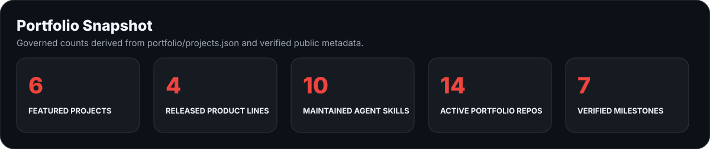
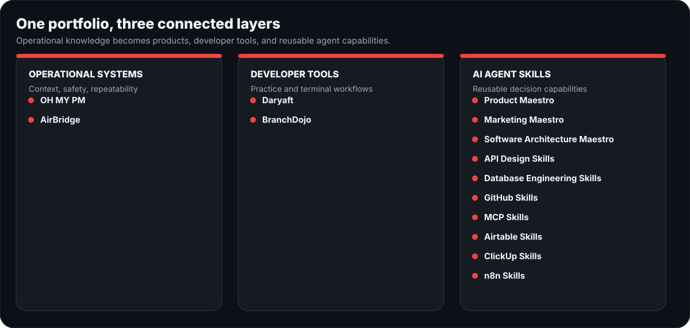
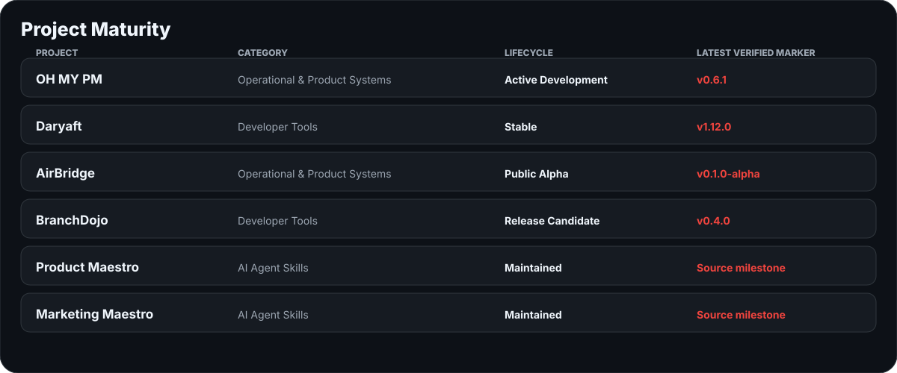
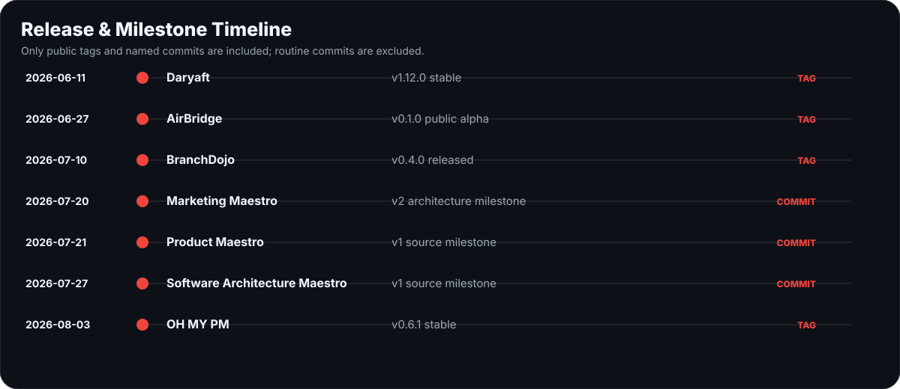
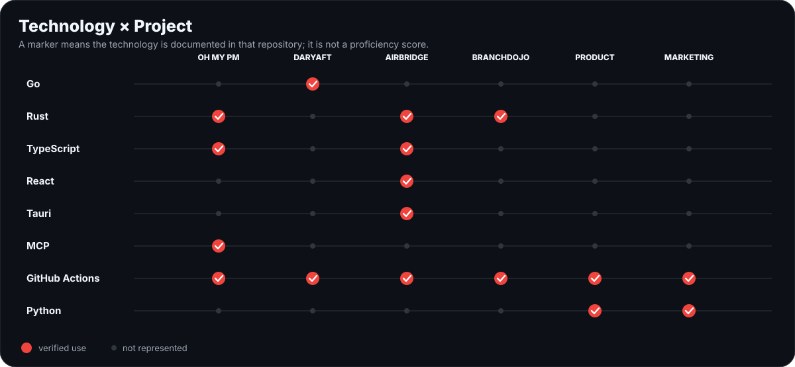

<!-- Generated visuals are governed by portfolio/projects.json. Edit curated facts there, then run npm run generate. -->

  

  <a href="https://xhesam.com">Website</a> ·
  <a href="https://www.linkedin.com/in/he8um/">LinkedIn</a> ·
  <a href="mailto:info@xhesam.com">Email</a> ·
  <a href="#selected-work">Selected Work ↓</a>

## Professional Summary

I design the operating systems behind execution: how work enters a team, gains an owner, moves through a workflow, becomes visible, and produces evidence for the next decision. My public work turns recurring operational problems into local-first products, developer tools, and reusable AI-agent Skills. That includes a project-intelligence CLI and MCP server, a safe Airtable backup desktop app, terminal tools in Go and Rust, and governed Skills for product, marketing, architecture, APIs, databases, GitHub, MCP, ClickUp, Airtable, and n8n. Across them, documentation, validation, release discipline, and explicit safety boundaries are treated as product features—not cleanup work.

## Portfolio Snapshot

<picture>
  <source media="(max-width: 600px)" srcset="./assets/generated/portfolio-snapshot-mobile.svg" />
  
</picture>

These counts are deterministic. Their calculation rules live in [`portfolio/projects.json`](./portfolio/projects.json); profile, empty, archived, private, and distribution-only repositories are excluded from portfolio counts.

## Selected Work

### 01 — [OH MY PM](https://github.com/he8um/oh-my-pm)

`Operational & Product Systems` · `Active Development` · `TypeScript + Rust/WASM + MCP`

A local project-intelligence system that turns repository context into structured briefs, risks, next actions, handoffs, plans, and governed Project Memory. **Latest stable:** [`v0.6.1`](https://github.com/he8um/oh-my-pm/releases/tag/v0.6.1). **Source:** `0.6.2`, prepared but unpublished. [Release notes](https://github.com/he8um/oh-my-pm/blob/main/docs/releases/v0.6.1.md)

### 02 — [Daryaft](https://github.com/he8um/daryaft)

`Developer Tool` · `Stable` · `Go + Bubble Tea`

A terminal downloader with CLI and TUI workflows, resumable transfers, retries, checksums, diagnostics, and release packaging. **Latest stable:** [`v1.12.0`](https://github.com/he8um/daryaft/releases/tag/v1.12.0), distributed through GitHub archives and Homebrew. [Public roadmap](https://github.com/he8um/daryaft/blob/main/wiki/Roadmap.md)

### 03 — [AirBridge](https://github.com/he8um/AirBridge)

`Operational & Product Systems` · `Public Alpha` · `Tauri + Rust + React/TypeScript`

A local-first desktop app for backing up, inspecting, validating, and planning safe restoration of Airtable bases. **Latest release:** [`v0.1.0-alpha`](https://github.com/he8um/AirBridge/releases/tag/v0.1.0-alpha). Backup and dry-run planning are available; live restore writes remain deliberately disabled. [Release notes](https://github.com/he8um/AirBridge/blob/main/docs/release/v0.1.0-alpha-release-notes.md)

### 04 — [BranchDojo](https://github.com/he8um/branchdojo)

`Developer Tool` · `Release Candidate` · `Rust + Git`

A CLI that creates disposable Git repositories for practicing real conflict, recovery, history, and release workflows. **Latest release:** [`v0.4.0`](https://github.com/he8um/branchdojo/releases/tag/v0.4.0). **Source:** `v0.5.0` release-candidate ready, without a final tag or GitHub Release. [Public roadmap](https://github.com/he8um/branchdojo/blob/main/ROADMAP.md)

### 05 — [Product Maestro](https://github.com/he8um/product-maestro)

`AI Agent Skill` · `Maintained` · `Python + JSON Schema`

A production-grade Skill that guides AI agents through product diagnosis, evidence, strategy, discovery, delivery, measurement, lifecycle, and governance. The public repository contains its v1 source milestone, installable package, examples, and validation suite; no public version tag is claimed.

### 06 — [Marketing Maestro](https://github.com/he8um/marketing-maestro)

`AI Agent Skill` · `Maintained` · `Python + JSON Schema`

A production-grade Skill for evidence-led marketing diagnosis, strategy, execution, measurement, operations, governance, and compliance. The v2 architecture milestone is present on `main` with schemas, examples, packaged output, and validators; no public version tag is claimed.

## Project Ecosystem Map

<picture>
  <source media="(max-width: 600px)" srcset="./assets/generated/ecosystem-map-mobile.svg" />
  
</picture>

- **Operational systems:** OH MY PM and AirBridge turn operational context, safety boundaries, and repeatable validation into products.
- **Developer tools:** Daryaft and BranchDojo make terminal workflows safer and more usable.
- **AI Agent Skills:** ten maintained repositories package domain decisions, evidence standards, governance, and validation for agents.

The broader Skill layer includes [Software Architecture Maestro](https://github.com/he8um/software-architecture-maestro), [API Design Skills](https://github.com/he8um/api-design-skills), [Database Engineering Skills](https://github.com/he8um/database-engineering-skills), [GitHub Skills](https://github.com/he8um/github-skills), [MCP Skills](https://github.com/he8um/mcp-skills), [Airtable Skills](https://github.com/he8um/airtable-skills), [ClickUp Skills](https://github.com/he8um/clickup-skills), and [n8n Skills](https://github.com/he8um/n8n-skills).

## Project Maturity and Status

<picture>
  <source media="(max-width: 600px)" srcset="./assets/generated/maturity-matrix-mobile.svg" />
  
</picture>

- **Stable:** Daryaft `v1.12.0`.
- **Active development with a stable release:** OH MY PM `v0.6.1`; source `0.6.2` is prepared.
- **Public alpha:** AirBridge `v0.1.0-alpha`.
- **Release candidate:** BranchDojo source `v0.5.0`; latest public release `v0.4.0`.
- **Maintained source milestones:** Product Maestro v1 and Marketing Maestro v2; neither is presented as a tagged release.

Publicly stated next markers are limited to OH MY PM `v0.6.2` publication and the final BranchDojo `v0.5.0` tag/release. Private plans are not represented.

## Release Timeline

<picture>
  <source media="(max-width: 600px)" srcset="./assets/generated/release-timeline-mobile.svg" />
  
</picture>

`2026-06-11` [Daryaft v1.12.0](https://github.com/he8um/daryaft/releases/tag/v1.12.0) · `2026-06-27` [AirBridge v0.1.0-alpha](https://github.com/he8um/AirBridge/releases/tag/v0.1.0-alpha) · `2026-07-10` [BranchDojo v0.4.0](https://github.com/he8um/branchdojo/releases/tag/v0.4.0) · `2026-07-20` [Marketing Maestro v2 source milestone](https://github.com/he8um/marketing-maestro/commit/4c5583b20d05ba510fd2d83d9216a51f622e0935) · `2026-07-21` [Product Maestro v1 source milestone](https://github.com/he8um/product-maestro/commit/0b6b3d7cd48fb91c852c03acf9b3360c830c130f) · `2026-07-27` [Software Architecture Maestro v1 source milestone](https://github.com/he8um/software-architecture-maestro/commit/ce497c4a824061a3636ddfa3822d626d7c77a045) · `2026-08-03` [OH MY PM v0.6.1](https://github.com/he8um/oh-my-pm/releases/tag/v0.6.1)

## Technology × Project Map

<picture>
  <source media="(max-width: 600px)" srcset="./assets/generated/technology-project-map-mobile.svg" />
  
</picture>

- **Go:** Daryaft. **Rust:** OH MY PM, AirBridge, BranchDojo.
- **TypeScript:** OH MY PM and AirBridge. **React + Tauri:** AirBridge.
- **MCP:** OH MY PM. **Python + JSON Schema:** Product Maestro and Marketing Maestro.
- **GitHub Actions:** validation and delivery automation across all six featured repositories.

The markers mean documented use in a repository—not a proficiency score or claim of equal depth.

## How I Build

**Diagnose → Model → Build → Validate → Operate → Improve**

1. Evidence before assumptions.
2. Clear ownership before automation.
3. Automation after process clarity.
4. Documentation as part of the system.
5. Release discipline over invisible progress.

> Project Management is a System Design Problem.

## Current Focus

- Closing the public `v0.6.2` Project Memory integrity line in OH MY PM while preserving stable behavior.
- Expanding the Maestro and companion-Skill ecosystem as governed, independently installable capabilities.
- Moving BranchDojo from its public `v0.5.0` release-candidate state to a final tagged release.
- Continuing safe-by-default, local-first product patterns across Rust, Go, TypeScript, CLI, MCP, and desktop work.

## Technical Stack

- **Product & Operations:** product systems, project delivery, ClickUp, Airtable, decision records, documentation architecture.
- **Automation & Integration:** n8n, REST APIs, webhooks, MCP, workflow orchestration, deterministic validation.
- **Product Engineering:** TypeScript, React, Astro, Go, Rust, Tauri, Python, JSON Schema.
- **Platform & Delivery:** GitHub Actions, Docker, PostgreSQL, Cloudflare, release archives, checksums, CI governance.

## GitHub Activity

Critical portfolio content above is local and remains useful if these optional services are unavailable.

  
  

## Contact

[xhesam.com](https://xhesam.com) · [LinkedIn](https://www.linkedin.com/in/he8um/) · [info@xhesam.com](mailto:info@xhesam.com)

Building systems that make execution clearer, safer, and more repeatable.
